# Super Mall - Shopping Mall Management System

Live at: https://super-mall-78902.web.app/

A comprehensive web application for managing a shopping mall, built with React and Firebase. The system provides separate interfaces for administrators and users, offering a complete solution for mall management and shopping experience.

## Features

### Admin Features
- **Dashboard**: Comprehensive overview of mall statistics
- **Shop Management**: Add, edit, and manage mall shops
- **Product Management**: Handle products across different shops
- **Offer Management**: Create and manage promotional offers
- **Category & Floor Management**: Organize shops by categories and floors

### User Features
- **Shop Discovery**: Browse and explore mall shops
- **Product Browsing**: View products from different shops
- **Offer Tracking**: Access current promotional offers
- **Product Comparison**: Compare products across different shops

## Technology Stack

- **Frontend**: React.js with Tailwind CSS
- **Backend**: Firebase (Authentication, Firestore)
- **State Management**: React Context API
- **Routing**: React Router v7
- **Styling**: Tailwind CSS for responsive design

## Screenshots

### Landing Page


### Admin Interface

#### Dashboard
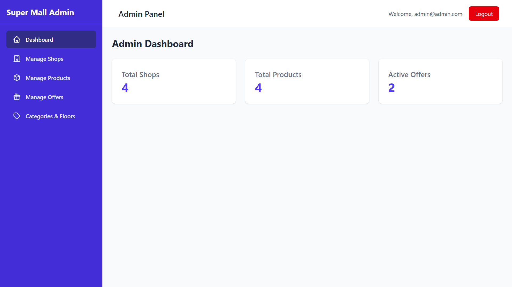

#### Shop Management
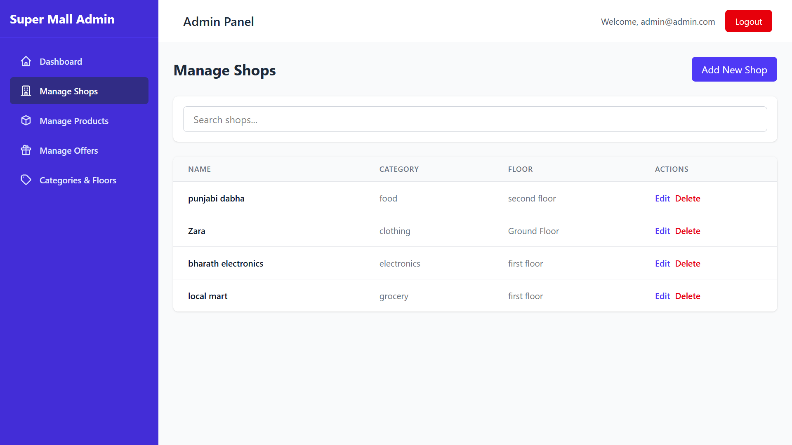
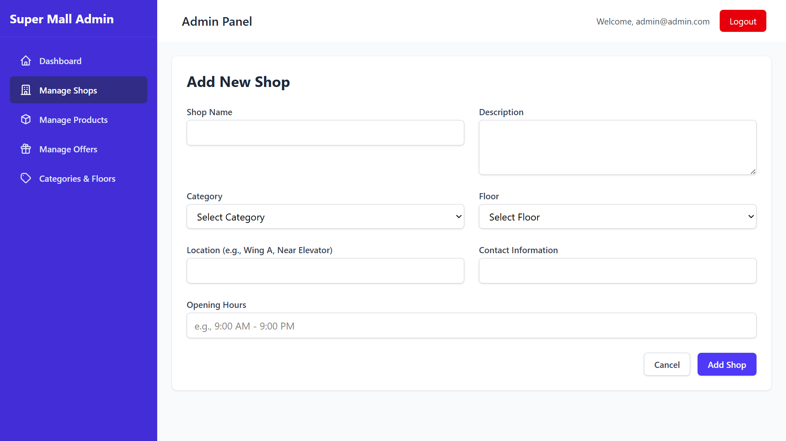

#### Product Management
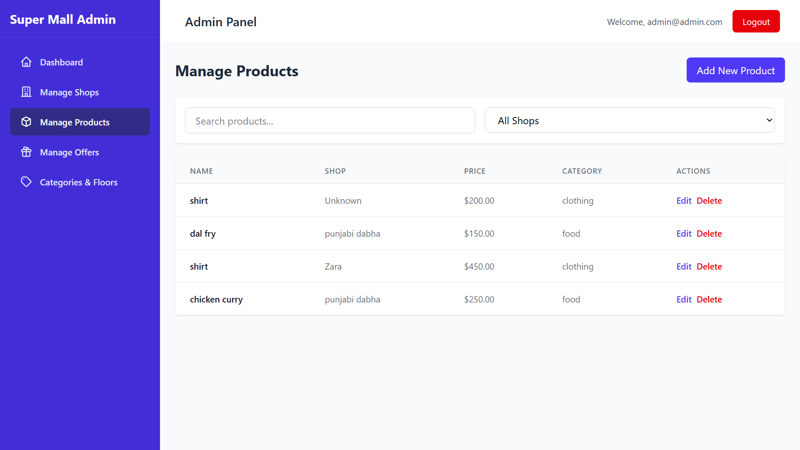
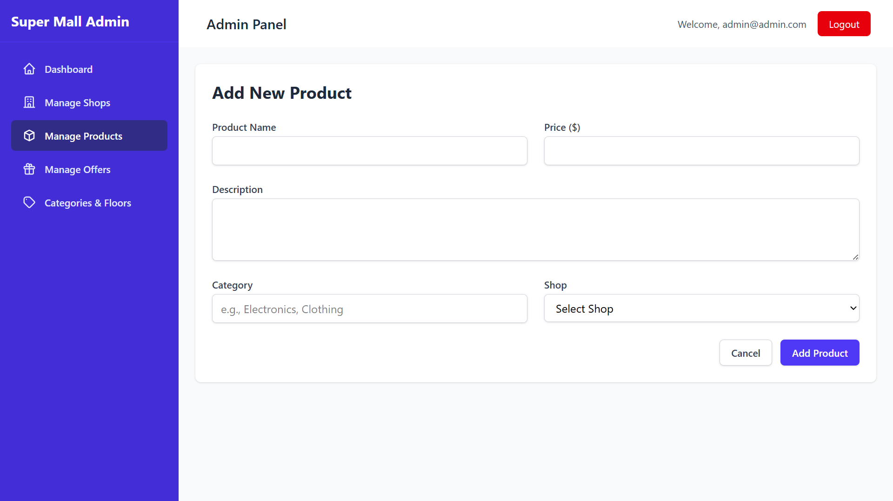

#### Offer Management
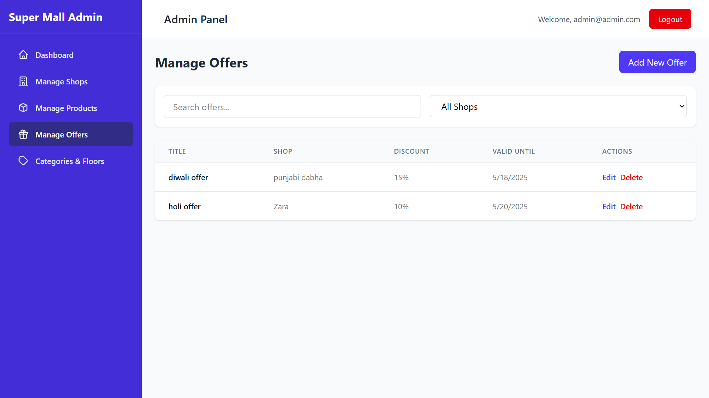
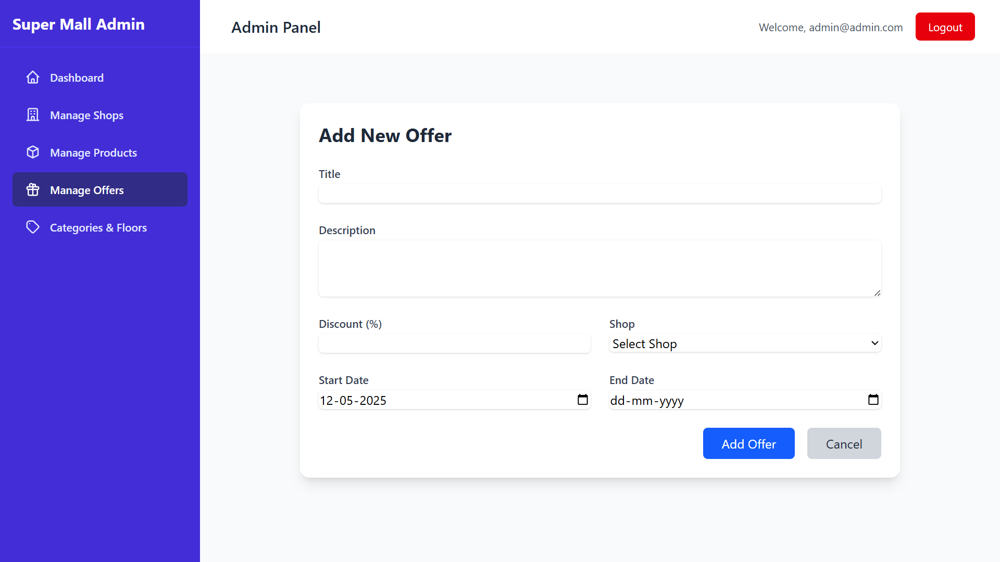
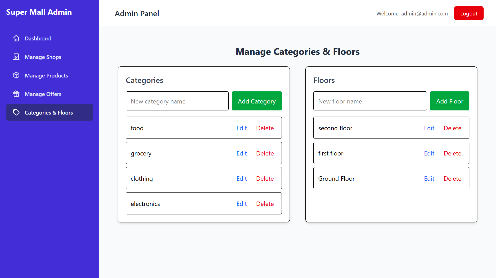

### User Interface

#### Dashboard
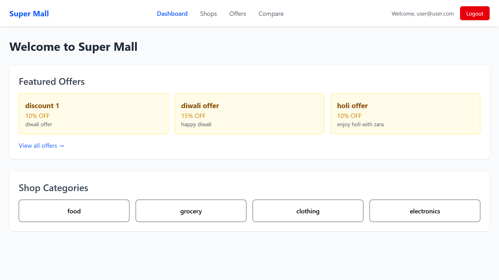

#### Shop Browsing
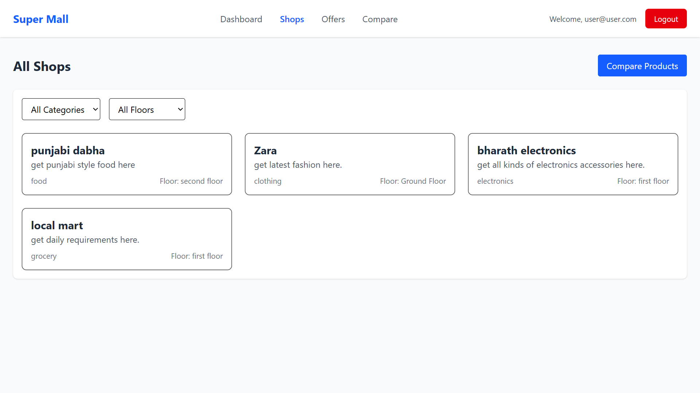

#### Offers View
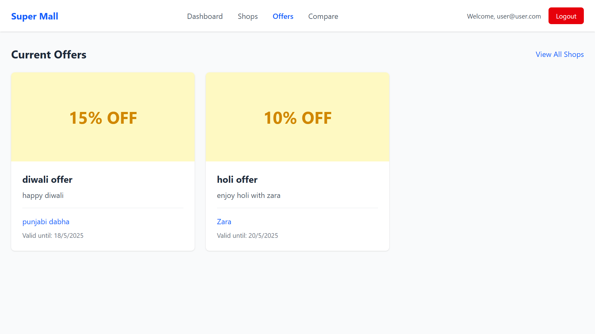

#### Product Comparison
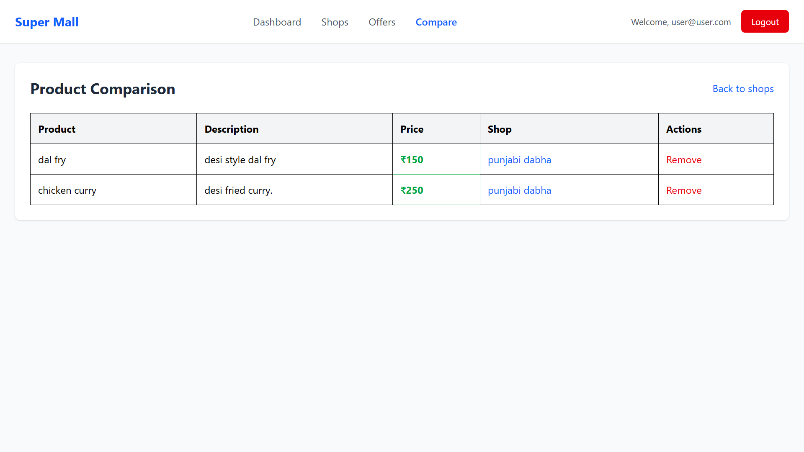

## Setup Instructions

1. Clone the repository:
   ```bash
   git clone https://github.com/yourusername/super-mall.git
   cd super-mall
   ```

2. Install dependencies:
   ```bash
   npm install
   ```

3. Create a Firebase project and add your configuration:
   - Create a `.env` file in the root directory
   - Add your Firebase configuration:
     ```
     VITE_FIREBASE_API_KEY=your_api_key
     VITE_FIREBASE_AUTH_DOMAIN=your_auth_domain
     VITE_FIREBASE_PROJECT_ID=your_project_id
     VITE_FIREBASE_STORAGE_BUCKET=your_storage_bucket
     VITE_FIREBASE_MESSAGING_SENDER_ID=your_messaging_sender_id
     VITE_FIREBASE_APP_ID=your_app_id
     ```

4. Start the development server:
   ```bash
   npm run dev
   ```

## Project Structure

```
super-mall/
├── src/
│   ├── components/
│   │   ├── admin/       # Admin interface components
│   │   ├── auth/        # Authentication components
│   │   ├── common/      # Shared components
│   │   └── user/        # User interface components
│   ├── context/         # React Context providers
│   ├── firebase/        # Firebase configuration
│   └── App.jsx          # Main application component
├── public/              # Static assets
└── package.json         # Project dependencies
```

## Features in Detail

### Admin Panel
- **Dashboard**: View total shops, products, and active offers
- **Shop Management**: 
  - Add new shops with details
  - Edit existing shop information
  - Manage shop categories and floor locations
- **Product Management**:
  - Add and edit products
  - Assign products to shops
  - Set product categories and prices
- **Offer Management**:
  - Create time-limited offers
  - Manage discount percentages
  - Track offer performance

### User Interface
- **Shop Discovery**:
  - Browse shops by category
  - View shop details and locations
- **Product Browsing**:
  - Search products
  - Filter by category
  - View product details
- **Offer Access**:
  - View current offers
  - Filter offers by shop
- **Product Comparison**:
  - Compare prices across shops
  - Compare product features

## Contributing

1. Fork the repository
2. Create your feature branch (`git checkout -b feature/AmazingFeature`)
3. Commit your changes (`git commit -m 'Add some AmazingFeature'`)
4. Push to the branch (`git push origin feature/AmazingFeature`)
5. Open a Pull Request

## License

This project is licensed under the MIT License - see the [LICENSE](LICENSE) file for details.

## Contact

Your Name - your.email@example.com
Project Link: [https://github.com/yourusername/super-mall](https://github.com/yourusername/super-mall)